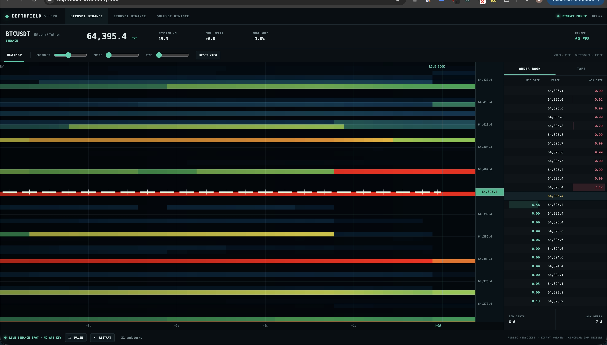

<div align="center">

# Depthfield

### A fast, open-source market-depth heatmap for the browser

Watch resting liquidity evolve, disappear, and trade in real time. Depthfield connects directly to public exchange data and renders the order book with WebGPU—no account, API key, extension, or backend required.

[](https://github.com/beejmaxx/depthfield/actions/workflows/pages.yml)
[](https://beejmaxx.github.io/depthfield/)
[](LICENSE)

**[Launch Depthfield](https://beejmaxx.github.io/depthfield/)** · [Netlify mirror](https://depthfield-live.netlify.app/) · [Report a bug](https://github.com/beejmaxx/depthfield/issues)

</div>



> [!IMPORTANT]
> Depthfield is experimental market-visualization software, not a trading platform or financial advice. Verify data independently before relying on it.

## Why Depthfield?

Most depth charts show only the order book *now*. A liquidity heatmap makes the missing dimension visible: where orders were resting, when they were added or pulled, and how price reacted as liquidity changed.

Depthfield is built as a transparent, clean-room implementation that anyone can inspect, run, and improve. The web app is the primary experience; the repository also contains an earlier native Rust prototype.

## Highlights

| Capability | Implementation |
| --- | --- |
| Live public data | BTCUSDT, ETHUSDT, and SOLUSDT from Binance Spot |
| Zero credentials | Public REST snapshot and WebSocket streams connect directly from a Web Worker |
| GPU rendering | One-pass WebGPU heatmap with circular textures; historical pixels are never shifted |
| Honest book state | Snapshot-plus-diff sequencing, gap detection, and automatic simulator fallback |
| Live executions | Volume-scaled buy/sell trade bubbles and cumulative delta |
| Deep zoom | Multi-resolution 20 ms, 200 ms, and 1 s history levels covering roughly 5 seconds to 68 minutes |
| Navigation | Cursor-anchored zoom, drag-to-pan, time presets, crosshair inspection, and return-to-live |
| Price aggregation | One setting shared by the heatmap, price axis, and order-book ladder |
| Stable intensity | Slowly adapting percentile normalization and a visible liquidity scale |
| Long-range correctness | Per-column price anchors preserve history when the live book recenters |
| Persistent local history | Multi-resolution IndexedDB recording restores the heatmap after a refresh |
| Portable recordings | Export and import compact `.depthfield` files directly in the browser |

The exchange depth source currently delivers changes at **100 ms**. Depthfield records those real states on a **50 Hz display timeline** while best bid/ask and raw trades arrive in real time. Repeated display samples represent an unchanged book—they are not invented orders.

## Run locally

Requirements:

- Node.js 22 or newer
- a current WebGPU-capable browser
- hardware acceleration enabled

```bash
git clone https://github.com/beejmaxx/depthfield.git
cd depthfield/web
npm ci
npm run dev
```

Open <http://127.0.0.1:5173>.

Build the optimized application:

```bash
npm run build
npm run preview
```

If Binance public endpoints are unavailable in your region or network, Depthfield automatically switches to its deterministic local simulator.

## Controls

| Action | Control |
| --- | --- |
| Zoom through time | Mouse wheel or the **TIME** slider |
| Zoom through price | **Shift + mouse wheel** or the **PRICE** slider |
| Inspect history | Move the crosshair over the chart |
| Pan backward | Drag the historical chart horizontally |
| Return to the current book | **LIVE** |
| Select a time window | **5S**, **30S**, **2M**, or **15M** |
| Change price buckets | **AGG** selector |
| Freeze incoming updates | **PAUSE** |
| Save a portable recording | **EXPORT** |
| Restore a recording | **IMPORT** |

## Local history and recordings

Depthfield continuously records the live heatmap into IndexedDB after the Binance snapshot is synchronized. The recorder keeps three bounded resolutions so short-range detail remains dense while longer sessions stay compact:

| Resolution | Local retention | GPU-visible window |
| --- | ---: | ---: |
| 20 ms display states | 2 minutes | about 82 seconds |
| 200 ms states | 30 minutes | about 14 minutes |
| 1 s states | 24 hours | about 68 minutes |

Refresh the page and the most recent continuous timeline is restored before the live socket starts. Time spent with the page closed is represented as an empty gap rather than invented liquidity. Each market and aggregation setting has an independent recording.

**EXPORT** downloads the retained data as a compact binary `.depthfield` file. **IMPORT** validates and merges a recording without replacing newer local chunks. These files contain the sampled heatmap states and execution aggregates needed by the visualization; they are not raw exchange-message archives.

## How it works

```text
Binance public REST snapshot + WebSocket diffs / BBO / trades
                              │
                              ▼
               sequence-aware market Web Worker
                              │
                 compact transferable binary frames
                              │
                              ▼
        20 ms ─────── 200 ms ─────── 1 s circular history
                              │
             liquidity texture + per-column anchors
                              │
                              ▼
          WebGPU heatmap + Canvas trade/interaction overlay
```

The past and present are deliberately separate. Once a depth column moves behind the live boundary it is never rewritten; only the live-book texture remains mutable.

Important source boundaries:

- [`web/src/market.worker.ts`](web/src/market.worker.ts) — public feeds, book sequencing, aggregation, metrics, and simulation fallback
- [`web/src/protocol.ts`](web/src/protocol.ts) — compact worker-to-UI binary frame contract
- [`web/src/renderer.ts`](web/src/renderer.ts) — circular WebGPU history, level-of-detail selection, trades, and interactions
- [`web/src/main.ts`](web/src/main.ts) — application state, controls, metrics, and order-book UI
- [`src/`](src/) — the native Rust/egui/wgpu prototype

## Data and limitations

- History begins when a browser first connects. Binance's public API does not provide historical Spot order-book depth from before that point.
- Recent history persists in IndexedDB and is isolated by instrument and aggregation. Browser storage can still be removed by the user or privacy controls, so export anything important.
- The renderer currently displays at most about 68 minutes even though the coarsest local recording is retained for 24 hours.
- Zoomed-out space before session start remains empty rather than being stretched or fabricated.
- This project reads public market data only. It does not place or manage orders.
- Availability, latency, and symbol rules remain subject to the exchange and the user's network.

## Deployment

Every relevant push to `main` is built and published by [GitHub Actions](.github/workflows/pages.yml). The Vite configuration derives the repository name during the Pages build, so forks can enable **Settings → Pages → GitHub Actions** without changing asset paths.

The included [`netlify.toml`](netlify.toml) provides the production build settings and cross-origin isolation headers for Netlify deployments.

## Native prototype

The native macOS prototype uses Rust, egui, and wgpu. It currently runs against synthetic data:

```bash
cargo run --release
```

Build a macOS application bundle:

```bash
sh scripts/package-macos.sh
open dist/Depthfield.app
```

## Roadmap

- [x] Direct public Binance Spot data
- [x] GPU heatmap, live book, multi-resolution zoom, and trade bubbles
- [x] Static hosting on GitHub Pages and Netlify
- [x] IndexedDB recording that survives refreshes
- [x] Portable browser-native history export/import
- [ ] Deterministic replay and timeline scrubbing
- [ ] Reconnect/resume telemetry and captured-feed correctness tests
- [ ] Coinbase and Kraken adapters
- [ ] Optional 24/7 collector for genuine pre-session history
- [ ] Rust/WASM acceleration where profiling demonstrates a real benefit

## Contributing

Issues, focused pull requests, performance traces, data-integrity tests, and exchange adapters are welcome. Good first contributions include accessibility improvements, additional palettes, replay fixtures, and UI tests.

Before opening a pull request:

```bash
cd web
npm ci
npm run build
```

Please keep the implementation clean-room. Do not submit copied proprietary code, assets, protocols, or reverse-engineered internals from commercial products.

## License

[MIT](LICENSE) © Depthfield contributors.

Depthfield is an independent project and is not affiliated with or endorsed by Binance or any commercial market-visualization vendor. Product and company names belong to their respective owners.
